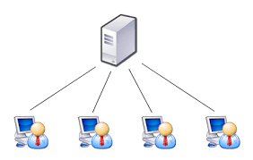

### Bibliotecas usadas

#### Cryptography, Socket, Json, Time, psutil, platform, os.

## Como executar o projeto

#### 1. Baixe o aplicativo e vá até pasta dos arquivos Host
```
cd App/Host/
```
#### 2. Utilize o Docker Compose

##### Windows
```
docker compose up -d --build ; docker attach server_tcp
```
##### Linux
```
docker compose up -d --build && docker attach server_tcp
```
#### 3. Em qualquer aparelho conectada na mesma rede, vá até os arquivos em:
```
cd App/User/
```
#### 4. Baixe as dependências
```
pip install -r requirements.txt
```

#### 5. Execute o cliente.py
```
python cliente.py
```
   


#   Objetivo do projeto 
 
### Construir um sistema cliente/servidor para inventário e monitoramento de computadores em rede, com descoberta automática, coleta de métricas, consolidação de dados e ação remota segura, por meio de comandos administrativos ou integração com ferramenta padrão de controle remoto.


# Objetivos concluídos:

#### ✅ Concluído 🟡 Parcial ❌ Não Realizado

## 1. Requisitos principais (4.0 pontos): ✅
* Arquitetura Cliente/Servidor (1,0) ✅
* Descoberta automática de clientes na LAN utilizando técnicas como broadcast, multicast ou mensagens periódicas de hello (1,0) ✅
* Uso de sockets puros (TCP e/ou UDP) para comunicação do protocolo desenvolvido (1,0) ✅
* Utilização do paradigma de Orientação a Objetos, com organização clara e modular do código (1,0) ✅

## 2. Coleta por cliente (2.0 pontos): ✅
* Quantidade de processadores/núcleos (0,4) ✅
* Memória RAM livre (0,4) ✅
* Espaço em disco livre (0,4) ✅
* IPs das interfaces de rede, incluindo status (UP/DOWN) e tipo (loopback, ethernet, wifi) (0,4) ✅
* Identificação do sistema operacional (0,4) ✅

## 3. Servidor/Consolidação (2.0 pontos): 🟡
* Dashboard em terminal ou interface gráfica simples com lista de clientes, última atualização, sistema operacional e IP principal (0,5) ✅
* Consolidação dos dados com cálculo de média simples e contagem de clientes online e offline. Cliente offline é aquele que não responde ao mecanismo de hello por mais de 30 segundos (0,5) 🟡
* Funcionalidade de detalhamento de um cliente selecionado (0,5) ✅
* Exportação de relatórios do consolidado geral e de um cliente específico nos formatos CSV ou JSON (0,5) ❌

## 4. Segurança (1.0 ponto): 🟡
* Comunicação segura utilizando criptografia e mecanismos de integridade ponta a ponta (0,5) ✅
* Autenticação dos clientes e controle de acesso por perfil (0,3) ✅
* Auditoria no servidor, registrando ações executadas, responsáveis e data/hora (0,2) ❌

## 5. Bônus (2.0 pontos): ❌
* Controle remoto do mouse do cliente (1,0) ❌
* Controle remoto do teclado do cliente (1,0) ❌


# Requisitos Principais

#### A arquitetura de rede Cliente/Servidor opera com um servidor central que funciona ininterruptamente, recebendo requisições de clientes que necessitam esporadicamente de um serviço distribuído por ele na rede.

<div align="center">  <p>Figura 1: Arquitetura Cliente-Servidor</p> </div>

#### Para implementar essa arquitetura neste projeto, foi decidida a utilização dos protocolos TCP e UDP. Para a descoberta automática dos clientes, o servidor central aguarda o envio de pacotes no socket UDP vindos de clientes que anunciam sua presença através de uma mensagem "HELLO" criptografada, enviada via broadcast. No momento em que o servidor recebe o pacote e confirma que se trata de uma mensagem válida, ele envia a esse endereço uma resposta "SUCESSO" criptografada e continua escutando novos pacotes UDP. Em paralelo, o socket TCP do servidor central aguarda uma tentativa de conexão para realizar o Three-way Handshake.
#### Assim que o cliente recebe a mensagem "SUCESSO" criptografada, ele descobre o IP do servidor que está oferecendo o serviço. Em seguida, armazena o endereço do servidor, fecha o socket UDP, abre um socket TCP e estabelece a conexão com o servidor central. A conexão permanece em uma rotina até que o cliente decida encerrar a rotina, finalizando assim o processo cliente.
<div align="center">  <p>Figura 2: Representação visual do fluxo de dados na arquitetura de rede Cliente-Servidor do projeto</p> </div>

#### Além disso, foi necessário dividir todo esse processo em três classes principais: Cliente, ServidorTCP e ServidorUDP. A divisão do servidor em dois tipos foi feita para habilitar a descoberta automática. Sem o uso de multithreading, o código do servidor ficaria travado aguardando conexões, impedindo a descoberta simultânea. Por esse motivo, a divisão foi realizada para que as conexões TCP e a descoberta automática pudessem ser executadas em paralelo, mesmo sem o uso de threads na mesma instância.
#### Essa decisão também permitiu separar as responsabilidades: o ServidorUDP funciona como uma "torre de transmissão", guiando o cliente para o servidor que realmente oferece o serviço (o ServidorTCP). Já o ServidorTCP fica responsável pela conexão e pelo processamento dos dados do cliente. Por fim, o cliente assume duas funções: a descoberta do servidor (realiza broadcast e identifica o IP) e o envio de dados (conecta via TCP e transmite as informações).
#### Visão estrutural de ServidorTCP, ServidorUDP e Cliente:
* Cliente: Conecta-se ao servidor, envia os dados e executa o ciclo de vida do cliente (encontrar servidor, conectar e enviar dados).

* ServidorTCP: Monitora a porta 6000 em busca de conexões TCP e processa os dados recebidos.

* ServidorUDP: Monitora a porta 6000 aguardando pacotes UDP com payload válido e confirma a descoberta do servidor (descoberta automática).

<div align="center">  <p>Figura 3: Estrutura modular dos componentes (Cliente, Servidor TCP e UDP).</p> </div>

# Segurança

#### A segurança utilizada no projeto é aplicada na comunicação entre servidor-cliente. Para isso, foi escolhida a biblioteca Fernet que aplica criptografia com uma chave de 32 bytes para criar uma cifra, cifra essa usada na criptografia dos payloads. No envio/recebimento dos pacotes via UDP e envio dos dados do cliente na conexão TCP é aplicado a criptografia, assim mantendo a integridade da comunicação, já que qualquer alteração na mensagem durante o transporte dela pela rede, a descriptografia falha. 

# Coleta de dados

#### A telemetria dos dados do cliente inclui a quantidade de processadores/núcleos, memória RAM livre, espaço em disco livre, IPs das interfaces de rede, seus status e tipos, e a identificação do SO. Com esse propósito, é criada uma classe auxiliar chamada dadosCliente, responsável pelo armazenamento dos dados do cliente, que utiliza as bibliotecas psutil (métricas de hardware), platform (dados do SO) e socket (manipulação de endereços).
#### A instância dessa classe inicia com seu construtor coletando o sistema do cliente e sua versão. Na classe, existem dois métodos: tipo_interface() e coletarDados(). O método coletarDados() consolida as informações de CPU, RAM e Disco em dicionários. Ademais, coleta todos os IPs das interfaces de rede e seus status e, em um _loop_, filtra essas informações (IPv4, IPv6, Status, MAC e nome) e utiliza o método auxiliar tipo_interface() para identificar o tipo da interface. Por fim, adiciona todas essas informações em uma lista de dicionários e, no fim do método, retorna um dicionário com sistema, informações da CPU, RAM, Disco e das placas de rede.

### Integração de dadosCliente ao projeto:

#### A classe dadosCliente é integrada ao projeto na classe Cliente. No construtor da classe Cliente, a variável dados é inicializada com uma instância do objeto dadosCliente.
#### Após a inicialização, esse objeto é utilizado no método enviarDados(). Nesse método, a variável dadosMonitoramento recebe o retorno de coletarDados() da classe Cliente, seu conteúdo é convertido para o formato JSON, criptografado e, por fim, enviado ao servidor central.

# Servidor/Consolidação

#### Para a visualização desses dados pelo usuário controlador do servidor, foi criada uma classe chamada Interface. Essa classe utiliza as bibliotecas os (rotinas do SO) e time (manipulação de tempo).
#### A Interface possui três métodos: clean(), desenharDashboard() e detalharCliente(). Primeiro, clean() identifica o S.O. do servidor e executa o comando de limpeza de tela apropriado. Segundo, desenharDashboard() recebe uma lista dos clientes que já se conectaram ao servidorTCP, limpa a tela e imprime uma tabela organizada com IP, S.O. e Status (On-line ou Off-line), o status é determinado pela diferença de tempo entre o último envio de dados do cliente ao servidor e o momento em que a tabela é exibida na tela. Se a diferença for maior que 30 segundos, o cliente é classificado como Off-line; caso contrário, como On-line.
#### Por último, detalharCliente() recebe o IP-alvo e seus respectivos dados, imprimindo na tela uma tabela com IP, S.O., CPU, RAM, Disco e Interfaces de Rede. Caso o servidor não possua nenhum registro do cliente do IP-alvo, o método informa ao usuário que não foram encontrados dados e retorna ao dashboard simplificado.
### Integração de Interface ao projeto:
#### A classe Interface é integrada ao projeto na classe ServidorTCP. No construtor da classe ServidorTCP, a variável tela é inicializada com uma instância da Interface e a variável clientes inicia como uma lista vazia. Logo após, no momento em que o ServidorTCP recebe uma conexão válida, ele chama o método processar_dados_cliente().
#### Durante o processamento dos dados, é inserido mais um item no dicionário de dados do cliente: a chave "visibilidade", cujo valor é o registro de tempo em que o pacote foi recebido. Prosseguindo, a lista clientes é atualizada com um dicionário onde a chave é o IP do cliente e o valor contém seus dados completos. Em seguida, o sistema chama o método desenharDashboard do objeto tela com a lista atualizada.
#### Durante a execução do ServidorTCP, o usuário também pode pressionar Ctrl + C. Esse comando limpa a tela e desenha um menu com as opções: detalhar um cliente, voltar ao dashboard simplificado ou encerrar o servidor. Se o usuário escolher "Detalhar um cliente", surge uma tela com os IPs disponíveis para auxiliar na digitação, e o IP-alvo escolhido é passado como parâmetro para o método detalharCliente(). Caso escolha "Voltar ao monitoramento", o sistema chama o método dashboard e retorna ao painel simplificado. Por último, se o usuário escolher "Sair", a execução do ServidorTCP é encerrada.
